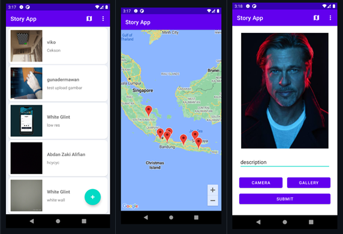

# StoryinApp

**StoryinApp** adalah aplikasi berbagi cerita (story) yang memungkinkan pengguna untuk mengunggah momen dalam bentuk foto beserta deskripsi, melihat cerita dari pengguna lain dalam bentuk daftar yang responsif, serta melihat persebaran lokasi cerita pada peta. Proyek ini dikembangkan sebagai submission untuk kelas **Belajar Pengembangan Aplikasi Android Intermediate** di **Bangkit Academy**.

## Preview


## Fitur
- **Autentikasi**: Registrasi dan Login akun pengguna.
- **List Story**: Menampilkan daftar cerita dari seluruh pengguna dengan teknik *Pagination* untuk performa yang optimal.
- **Detail Story**: Informasi lengkap mengenai cerita yang dipilih, termasuk foto, nama pengunggah, dan deskripsi.
- **Upload Story**: Mengunggah foto baru melalui Galeri atau Kamera disertai dengan deskripsi dan lokasi (opsional).
- **Story Maps**: Menampilkan lokasi cerita-cerita pengguna lain pada Google Maps.
- **Localization**: Dukungan bahasa (Indonesia & Inggris) sesuai dengan pengaturan perangkat.
- **Dark Mode Support**: Mendukung tampilan mode gelap dan terang.

## Arsitektur dan Teknologi
Aplikasi ini dibangun dengan mengikuti standar pengembangan aplikasi Android modern:
- **Bahasa**: Kotlin
- **Arsitektur**: MVVM (Model-View-ViewModel) dengan Repository Pattern.
- **Dependency Injection**: Manual Injection / Service Locator (sesuai modul pembelajaran).
- **Networking**: Retrofit & OkHttp untuk komunikasi dengan REST API.
- **Local Database**: Room untuk caching data.
- **Local Storage**: DataStore Preferences untuk menyimpan sesi pengguna (Token).
- **Paging 3**: Mengelola pemuatan data dalam jumlah besar secara bertahap.
- **Maps**: Google Maps SDK untuk fitur pemetaan.
- **Image Loading**: Coil untuk pemuatan gambar yang efisien.
- **UI Components**: View Binding, Custom View, dan Material Design.
- **Testing**: Unit Test (Mockito, Coroutines Test) dan UI Test (Espresso, Idling Resource).

## Cara Menjalankan Projek
1. **Buka di Android Studio**: Pilih "Open" dan arahkan ke folder projek ini.
2. **API Key**: Pastikan Anda memiliki API Key Google Maps yang valid. Tambahkan key tersebut di file `local.properties`:
   ```properties
   MAPS_API_KEY=YOUR_API_KEY_HERE
   ```
3. **Sync Gradle**: Tunggu hingga proses sinkronisasi Gradle selesai.
4. **Run**: Jalankan aplikasi di Emulator atau Perangkat Fisik.

## Struktur Folder Utama
```text
app/src/main/java/com/dicoding/storyapp/
├── data/          # Sumber data (Remote & Local), Repository, dan Paging Source
├── di/            # Dependency Injection (Injection.kt)
├── view/          # UI Components (Activity, ViewModel, Adapter) yang dibagi per fitur
└── utils/         # Helper classes (Date Formatter, Camera Utils, dll)
```
